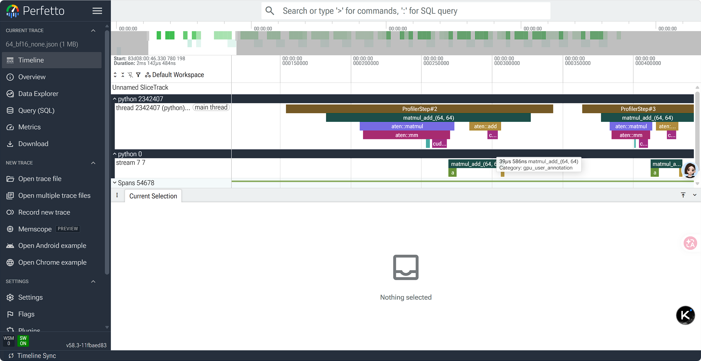

# torch.profiler 学习笔记（01 扫盲）

复现「torch.profiler 系列 · 01 扫盲」里的内容：**§2.3 `record_function` 打标签**、
**§2.4 `activities` 与 `schedule` 配置**，以及被剖析用的那个完整脚本
[`01_matmul_add.py`](01_matmul_add.py)。

被剖析的算子是 `y = x @ w + b`。注意它**不是一个 kernel** —— `matmul` 和 `add`
是两个独立的算子（`torch.compile` 才会融合），这正是要用 profiler 把一段
「业务逻辑」整体看清楚的典型场景。

所有数字都是本机实测（8×A100-SXM4-40GB，conda env `cpp`：torch 2.9.0+cu128），
命令和产物都在仓库里，可以直接重跑。

---

## 目录

- [0. 快速开始](#0-快速开始)
- [1. 从数学到算子](#1-从数学到算子)
- [2. §2.3 打标签：`record_function`](#2-23-打标签record_function)
- [3. §2.4 配置剖析器：`activities` 与 `schedule`](#3-24-配置剖析器activities-与-schedule)
- [4. 实测：跑完得到什么](#4-实测跑完得到什么)
- [5. 踩坑清单](#5-踩坑清单)
- [6. [练习] 试试看](#6-练习-试试看)
- [7. 我的笔记](#7-我的笔记)

---

## 0. 快速开始

```bash
cd /mnt/public/nyt1/infra/practices/profiler/01_matmul_add

PY=/mnt/public/nyt1/docqa/restored_envs/cpp/bin/python
export CUDA_VISIBLE_DEVICES=7        # 先挑一张空闲卡

$PY 01_matmul_add.py                             # 默认：64×64 bf16，记录 20 步
bash run.sh                                      # 一键跑 README §4 的四组配置

# 换个规模 / 换精度 / 换模式
$PY 01_matmul_add.py --size 1024 --steps 10
$PY 01_matmul_add.py --dtype fp32
$PY 01_matmul_add.py --mode COMPILE              # torch.compile 包装后再剖析
```

产物：

```
traces/                            ← --trace-dir 的默认值就是它
├── <size>_<dtype>_<mode>.json    Chrome trace，拖进 https://ui.perfetto.dev 看时间线
└── <size>_<dtype>_<mode>.txt     prof.key_averages().table(...) 的耗时汇总表
```

脚本里写了 python 绝对路径，**不需要 `conda activate`**。
本机没有图形环境，所以看 trace 靠下载 json 到本地用 perfetto 打开。

---

## 1. 从数学到算子

`y = x @ w + b` 实际上是两步，先乘后加（`z = x @ w`，再加偏置 `b`）：

```
x = [[1, 2], [3, 4]]        w = [[5, 6], [7, 8]]        b = [[0.1, 0.2], [0.3, 0.4]]

z = x @ w  = [[19, 22], [43, 50]]
y = z + b  = [[19.1, 22.2], [43.3, 50.4]]      ← 最终输出
```

对应到 PyTorch 就是 `torch.add(torch.matmul(x, w), b)`，也就是脚本里的 `fn`。

**关键点：这两个步骤在 GPU 上是两次 kernel launch。** 后面的汇总表里
`aten::mm` 和 `aten::add` 是分开的两行、时间线上是两条独立的 bar ——
只有在 `--mode COMPILE` 下才会被融合成一个 `aten::addmm`（见 §4.3）。

---

## 2. §2.3 打标签：`record_function`

要对 `fn` 做性能分析，在 PyTorch 里的入口是 `torch.profiler.xxxx`。
第一步是**给算法打标签**：

```python
def step():
    with torch.profiler.record_function("matmul_add"):
        return fn(x, w, b)
```

核心作用是在性能剖析的时间线上打上**自定义标签**（相当于重命名）：直接通过
标签名找到感兴趣的代码段，而不必逐层展开算子堆栈（`ProfilerStep*` →
`aten::matmul` → `aten::mm` → `ampere_bf16_s16816gemm_...`）。
它支持**多层嵌套**，也几乎不影响性能（但会让代码变长）。

它还可以**传递额外的信息** —— 标签名本身可以用 f-string 拼：

```python
with torch.profiler.record_function(f"matmul_add_{x.shape}"):
    return fn(x, w, b)
```

这样 `matmul_add_(64, 64)` 这种带形状的标签会直接出现在时间线上，
不用额外翻日志就知道当前 `x` 的形状。

> 注意 `x.shape` 是 `torch.Size([64, 64])`，直接插值会得到
> `matmul_add_torch.Size([64, 64])`。脚本里写成 `tuple(x.shape)`
> 得到的是 `matmul_add_(64, 64)`，和视频里一致。

**实测验证**（`01_matmul_add.py` 默认配置，active=20 步）：

```
trace json 里的事件统计：
  user_annotation（record_function 打的标签）  20    ← 每步 1 条，active=20 步
  kernel（真正的 GPU kernel）                 20    ← mm + add，10 步 × 2
  cuda_runtime                               21
```

**嵌套也是真的可用**：`outer` 里套 `inner` 跑 3 步，时间线上外层 3 条、
内层 3 条都在，`key_averages` 表里也各有自己的行。

---

## 3. §2.4 配置剖析器：`activities` 与 `schedule`

`torch.profiler.profile(...)` 创建一个剖析器对象。正常用法：

```python
with torch.profiler.profile(
    activities=[
        torch.profiler.ProfilerActivity.CPU,   # the cpu activities
        torch.profiler.ProfilerActivity.CUDA,  # the gpu activities
    ],
) as prof:
    for _ in range(5):
        step()
        prof.step()          # ★ 每步都要调一次，见 §5 坑 1
```

### 3.1 `activities`：收哪些设备上的事件

它是一个列表，枚举值：

| 枚举 | 记录什么 |
|---|---|
| `ProfilerActivity.CPU` | CPU 侧活动：Python 函数调用、PyTorch 算子下发、内存分配等（**必须开启**） |
| `ProfilerActivity.CUDA` | GPU 侧活动：CUDA kernel 的启动和执行、显存拷贝等（**用 GPU 时开启**） |
| `ProfilerActivity.XPU` | 类似 CUDA，适用于 Intel GPU（PyTorch 编译了 XPU 支持时可用） |

### 3.2 `with ... as prof` 和 `prof.step()`

- `as prof`：把剖析器对象绑到变量 `prof`，在 `with` 块内可以通过 `prof`
  调用它的方法（`prof.step()` 等）；`with` 块结束时剖析器**自动执行清理工作**。
- `prof.step()`：告诉剖析器**当前这一步结束了**。它是 `schedule` 能推进的
  唯一动力 —— 不调它，`schedule` 永远停在第一步。

### 3.3 `schedule`：哪些步骤记录、哪些跳过

`torch.profiler.schedule(...)` 返回一个对象，定义了一组规则：

```python
schedule = torch.profiler.schedule(
    wait=1,     # 跳过 1 个步骤
    warmup=1,   # 预热 1 个步骤（运行但不记录）
    active=3,   # 正式记录 3 个步骤
    repeat=1    # 整个周期重复 1 次
)
```

一轮完整周期 = `wait + warmup + active` 步（`repeat` 是把这一轮重复几次）。
**所以循环次数要 ≥ 这个和**，否则凑不满一轮。脚本里写的是：

```python
schedule = torch.profiler.schedule(wait=1, warmup=1, active=args.steps, repeat=1)
with torch.profiler.profile(..., schedule=schedule) as prof:
    for _ in range(args.steps + 2):     # 1 + 1 + steps
        step()
        prof.step()
```

### 3.4 另外三个开关（脚本里都关了）

| 参数 | 本次取值 | 打开后会怎样 |
|---|---|---|
| `record_shapes` | `False` | `aten::mm` 这类行会带上输入 shape，如 `aten::mm(1024, 1024, 1024)` |
| `profile_memory` | `False` | 表里多出显存分配 / 释放的统计列 |
| `with_stack` | `False` | 每个算子上带 Python 调用栈（trace 体积涨得最狠的一个） |

默认关掉是为了报告干净、trace 小；要定位「谁调的这个算子」时才开 `with_stack`。

### 3.5 两个出口

```python
prof.export_chrome_trace(trace_path)                 # → 时间线（perfetto）
prof.key_averages().table(sort_by="cuda_time_total", row_limit=15)   # → 汇总表
```

- Chrome trace：按时间排的甘特图，看**顺序、重叠、空隙**（CPU 是不是在等 GPU）。
- `key_averages().table(...)`：按算子名聚合的耗时排行，看**谁最贵**。
  `sort_by` 还可以换 `"cpu_time_total"`、`"self_cuda_time_total"` 等。

---

## 4. 实测：跑完得到什么

`bash run.sh` 跑的四组，命令和产物一一对应：

| # | 命令 | 产物 |
|---|---|---|
| 1 | `01_matmul_add.py` | `64_bf16_none.{json,txt}` |
| 2 | `01_matmul_add.py --size 1024 --steps 10` | `1024_bf16_none.{json,txt}` |
| 3 | `01_matmul_add.py --size 1024 --dtype fp32 --steps 10` | `1024_fp32_none.{json,txt}` |
| 4 | `01_matmul_add.py --size 1024 --steps 10 --mode COMPILE` | `1024_bf16_COMPILE.{json,txt}` |

文件名是脚本里的 `tag = f"{args.size}_{args.dtype}_{args.mode}"`，
所以 **`1024_bf16_none` = 1024×1024 / bf16 / eager（`--mode` 默认就是 `none`）**。

### 4.0 数据出处与口径（每张表的数字怎么对上）

本节所有 `us` 数字都来自 `.txt` 汇总表，取的是这一列：

| 列 | 含义 |
|---|---|
| `CUDA total` | 该算子在整个记录窗内的 GPU 时间**总和** |
| `# of Calls` | 调用次数 = **active 步数**（`--steps`，默认 10 或 20） |
| **`CUDA time avg`** | `CUDA total ÷ # of Calls` = **平均每步** ✅ 本文全部用它 |

**时间窗 = 整个 active 阶段，不是某一步。** `schedule(wait=1, warmup=1, active=steps)`，
所以第 1 步（wait）和第 2 步（warmup）不记录，`# of Calls` 就等于 `--steps`。
要看某**单独一步**，去同名的 `.json`：里面每个 step 有独立的
`user_annotation` tag `ProfilerStep#N`（N 从循环第 0 步算起，wait=1+warmup=1 之后
active 的第 1 步是 `#2`，10 步就是 `#2` ~ `#11`），拖进 perfetto 可以直接量。

**每个数字对应哪一行**（以 COMPILE 组为例，命令见下）：

```
  ProfilerStep*                          293.823us   29.382us   10     ← 每步 GPU 总计
  aten::addmm                            293.823us   29.382us   10     ← 融合后唯一的算子
  ampere_bf16_s16816gemm_bf16_...        257.568us   25.757us   10     ← 真正的 gemm kernel
  Memcpy DtoD (Device -> Device)          36.255us    3.626us   10     ← 图模式拷贝输入
```

自己复算（对任何一份 `.txt` 都能用，自动跳过分隔线）：

```bash
cd /mnt/public/nyt1/infra/practices/profiler/01_matmul_add/traces
awk 'NF>10 && $(NF-1) ~ /(us|ms)$/ {n=$1; for(i=2;i<=NF-10;i++) n=n" "$i; \
     printf "  %-56s %12s %12s %5s\n", n, $(NF-2), $(NF-1), $NF}' 1024_bf16_COMPILE.txt
#                                        ↑CUDA total ↑CUDA avg  ↑calls
```

> ⚠️ **每次 `bash run.sh` 都会覆盖这四个文件，数字跟着变。**
> README 里的表格是**某一次运行的快照**（2026-09-23 那晚的产物），
> 你重跑后看到的会有 ~3% 以内的漂移。比值类结论（add 占比、fp32/bf16 倍数）
> 是稳的，绝对值请以你自己产物里的为准。
> 下面表格「出处」列里的行号同理，只对当前仓库里那份 `.txt` 成立。

### 4.1 默认配置的完整汇总表（64×64 bf16，active=20）

```
Name                                          Self CPU   CPU total  CUDA time avg   # of Calls
matmul_add_(64, 64)                             0.000us      0.000us        17.814us          20   ← 只有 CUDA
ProfilerStep*                                 413.148us      1.474ms         8.325us          20
matmul_add_(64, 64)                           368.857us      1.061ms         8.325us          20   ← 只有 CPU
aten::matmul                                   37.269us    452.009us         5.822us          20
aten::mm                                      301.522us    414.740us         5.822us          20
ampere_bf16_s16816gemm_bf16_64x64_sliced1x2_ldg8_f2f_stages_...
                                                0.000us      0.000us         5.822us          20   ← 真正的 kernel
aten::add                                     146.826us    240.256us         2.502us          20
void at::native::vectorized_elementwise_kernel<4, at...>
                                                0.000us      0.000us         2.502us          20   ← 真正的 kernel
cudaOccupancyMaxActiveBlocksPerMultiprocessor   15.519us     15.519us         0.000us          20
cudaLaunchKernel                              191.129us    191.129us         0.000us          40
cudaDeviceSynchronize                          19.495us     19.495us        19.495us           1
Self CPU time total: 1.494ms
Self CUDA time total: 166.496us
```

（完整表格见 [`traces/64_bf16_none.txt`](traces/64_bf16_none.txt)，
按 `cuda_time_total` 排序取 Top 15）

### 4.1.1 这张表怎么读（层级 / 双时钟 / 17.814 与 8.325 为什么不一样）

#### ① 是包含关系，但被 `key_averages()` 打平了

`key_averages()` 把同名事件聚合后**没有任何缩进**，所以肉眼看不出父子。
但 `Self CPU` 和 `CPU total` 两列就是层级证据 —— `CPU total` = 自己 + 所有子调用：

```
ProfilerStep*                        CPU total 1.474ms    ← kineto 每步的顶层标签
└─ matmul_add_(64, 64)                        1.061ms    ← 我的 record_function
   ├─ aten::matmul                           452.009us
   │  └─ aten::mm                            414.740us
   │     └─ cudaLaunchKernel ...... 191.129us（自身无子调用）
   │     └─ ampere_...gemm ... ← GPU kernel，CPU total = 0
   └─ aten::add                              240.256us
      └─ vectorized_... ...... ← GPU kernel，CPU total = 0
```

**判断规则**：`CPU total` 越小 = 层级越深；`Self CPU` = 刨掉子调用后"自己这段"花了多少。
（GPU kernel 行两列 CPU 都是 `0.000us` —— 它只在 GPU 上跑，CPU 侧没有自己的执行体。）

#### ② 11 列分别是什么

| 列 | 含义 |
|---|---|
| `Self CPU %` / `Self CPU` | 该算子**自身**（不含子调用）的 CPU 时间 |
| `CPU total %` / `CPU total` | 该算子 **+ 所有子调用** 的 CPU 时间 |
| `CPU time avg` | `CPU total ÷ # of Calls`，每次调用平均 |
| `Self CUDA` / `Self CUDA %` | 自身发起的 GPU 工作耗时 |
| `CUDA total` / `CUDA time avg` | 同上（含子调用）/ 每次平均 |
| `# of Calls` | 调用次数 = **active 步数** |

#### ③ 为什么同一行能同时有 CPU 时间和 CUDA 时间

因为**一次算子调用有两段耗时**，两个时钟各自计：

```
CPU 时钟：  ├─ 准备 / dispatch / 下发 ─┤                    → CPU 时间
GPU 时钟：                               ├─ kernel 执行 ─┤   → CUDA 时间
           ↑ CPU 派完活立刻返回，GPU 之后才跑（异步）
```

- 它们**不是相加关系**，是同一件事的两个侧面。
- 时间上**基本不重叠**（实测 GPU 比 CPU 晚 **25~26us** 才动，见 §7.4 ②）。
- 所以：`CPU total` 大 = **派活慢**（Python / dispatch / launch 开销大）；
  `CUDA total` 大 = **干活慢**（kernel 本身慢）。
  本例 CPU 每步 **46.6us**、GPU 每步 **8.3us** → **CPU 是瓶颈**（见 §7.4 ③）。

#### ④ 「GPU 能并行、CPU 只能串行」吗？—— 只对一半

| | 是否并行 | 实测证据 |
|---|---|---|
| CPU 侧 | **串行**（单线程） | 20 条 CPU annotation 起点间隔中位 **75.7us**，自身宽 **47.5us** → 无一重叠 |
| GPU kernel（同一 stream） | **也串行** | 本例只有默认流 `stream 7`，40 个 kernel 排队跑 |
| **CPU 派活 vs GPU 干活** | ✅ **并行（异步）** | 这正是必须 `torch.cuda.synchronize()` 才能测准的原因 |
| GPU kernel 之间 | 只有**多流/多卡**才真并行 | 本例没开多流，所以没有 |

#### ⑤ 最诡异的一点：两行 `matmul_add_` 的 CUDA 值是 17.814 和 8.325

**不是同一个东西，是两种口径**：

| 行 | 事件类型 | `CUDA total` 怎么算 | 值 |
|---|---|---|---|
| 第二行（有 CPU 时间那行；`ProfilerStep*` / `aten::*` 同理） | CPU 侧事件 | **它发起的 kernel 的 GPU 执行时间之和**，不含 GPU 空等 | **166.496us**（= 40 个 kernel 之和） |
| 第一行（只有 CUDA、CPU 全 0 那行） | GPU 侧 `gpu_user_annotation` | **GPU 时间轴上一个真实区间的长度**：从这段第一个 kernel 到最后一个 kernel，**含 GPU 空等的间隙** | **356.290us** |

单步拆开就明白了（取第 3 步）：

```
GPU 窗口 17.730us  =  gemm 5.824us  +  GPU 空等 9.410us  +  add 2.496us
                     └───────── kernel 之和只有 8.320us ─────────┘
```

**那 9.4us 里 GPU 什么也没干，在等 CPU 把 `add` 派过来**（CPU 每步要 46us）。
窗口长度把它算进去了，kernel 时间不算 —— 于是 356.290 / 166.496 = **2.14 倍**。

> 顺带修正我先前的一个错误猜测：我一度以为这 2.14 倍是「相邻 GPU 窗口互相重叠」造成的。
> 实测**不是** —— 20 条 GPU annotation 里重叠的相邻对是 **0**（相邻起点间隔 75.5us，
> 窗口自己才 16.1us，根本够不着）。重叠假设不成立，真正原因是**窗口内含 GPU 空等**。

#### ⑥ 纯 CPU 开销藏在哪

`cudaLaunchKernel` 191.129us（40 次，每次 **4.778us**）+ `cudaOccupancyMaxActive...`
15.519us（20 次，cublas 每次 launch 前查占用率）= **206.6us**，摊到 20 步是
**10.3us/步**。这只是两个 cudart API，剩下 36us 是 Python / ATen dispatch。
**64×64 这个规模下，绝大部分时间花在"派活"而不是"干活"上。**

三个可以直接读出来的信息：

1. **标签层级完整保留**：`matmul_add_(64, 64)` → `aten::matmul` → `aten::mm` →
   `ampere_...gemm`，一层套一层，每层的 `CUDA time avg` 都是 5.822us。
   `record_function` 的标签名把整段业务逻辑收成了**一行**（层级怎么读见 §4.1.1 ①）。
2. **两次 kernel launch 清清楚楚**：`cudaLaunchKernel` 被调了 **40 次**
   （20 步 × 2 个算子，每次 4.778us），`aten::mm` 和 `aten::add` 各对应一个真实 kernel。
3. **两行同名 = 两种口径**：GPU 侧那行 `Self CPU = 0.000us` 而 CUDA 是 356.290us，
   CPU 侧那行相反。**不是开销大，是两行量的东西不一样**（§4.1.1 ⑤、§5 坑 2）。
   顺带：`matmul_add_` 的 `Self CPU 368.857us`（18.4us/步）也不是标签本身的开销，
   而是「这段区间里不属于任何 aten 算子的部分」—— 含 Python 层与两个算子之间的空隙。

> **哪些数字可以信、哪些不能**：三轮重跑对比下来 ——
>
> | 行 | 四轮取值 | 结论 |
> |---|---|---|
> | `aten::mm` `CUDA time avg` | 5.826 / 5.824 / 5.827 / **5.822** | ✅ **稳**，±0.1%，可以拿来做性能结论 |
> | `Self CUDA time total` | 166.430 / 166.428 / 166.435 / **166.496** | ✅ 稳 |
> | `Self CPU time total` | 948.9 / 948.9 / 1512 / **1494**us | ❌ 飘 58%，受机器负载影响，别用 |
> | `record_function` 只带 CUDA 那行 | 12.864 / 12.238 / 17.995 / **17.814** | ❌ 飘 46%，**永远别引用它**（原因见 §4.1.1 ⑤） |
>
> 也就是：**只有具体算子行的 GPU 时间是可复现的**，其余都是参考。

### 4.2 三个规模/精度的对比（每步平均值，单位 us）

| 配置 | `aten::mm` / gemm | `aten::add` | 每步 GPU 合计 | add 占比 | 出处 |
|---|---|---|---|---|---|
| 64×64 bf16 | 5.822（Tensor Core） | 2.502 | 8.325 | **30.1%** | `64_bf16_none.txt` L8/L10/L5 |
| 1024×1024 bf16 | 24.093（Tensor Core） | 4.301 | 28.394 | 15.2% | `1024_bf16_none.txt` L8/L10/L5 |
| 1024×1024 fp32 | 165.534（CUDA core `sgemm` 164.180） | 6.096 | 171.630 | 3.6% | `1024_fp32_none.txt` L8/L10/L5 |

「每步 GPU 合计」取的是 **`ProfilerStep*` 那行的 `CUDA time avg`**（= 整个 active
窗的 GPU 时间 ÷ 步数），它总是等于 `aten::mm` + `aten::add` 两行之和 —— 可以当校验用。

三个结论：

- **`add` 不是"顺便"的**：64×64 时偏置加法占了 GPU 时间的 30%，规模越大占比越低
  （原因见 §4.2.1：不是硬件算力涨得快，是 `mm` 的计算量 ∝N³ 而访存量 ∝N²，
  而 `add` 的计算量和访存量都 ∝N²）。这条正是 §1 说的"它是两个 kernel"的量化后果，
  也是 `torch.compile` 融合它的动机。
- **fp32 → bf16 是 6.87×**（165.5 → 24.1 us）：fp32 走的是 `ampere_sgemm`
  （CUDA core），bf16 走 `s16816gemm`（Tensor Core）。同一个算子在
  profiler 表里的 kernel 名字直接告诉了你它走的是哪条通路。
- **fp32 下多出 `Memset (Device)` 1.354us/步**：`aten::add` 前要初始化输出，
  bf16 那组没有这一行。注意它是**计在 `aten::mm` 内部的**
  （`aten::mm` 165.534 > 子 kernel `sgemm` 164.180，差的 1.354us 就是它），
  所以单独看 `sgemm` 行会漏掉这部分。多看几个配置才能发现这种"隐藏"开销。

### 4.2.1 为什么规模越大 `add` 占比越低：算术强度

先看「每搬 1 字节做多少次运算」—— 算术强度 `AI = FLOPs / Bytes`
（下面 `s` = 每个元素的字节数，fp32 = 4、bf16 = 2）：

| 算子 | 计算量 | 访存量 | 算术强度 AI | 随 N 怎么变 |
|---|---|---|---|---|
| `aten::mm`（N×N×N） | 2N³ | 3N²·s | **2N / (3s)** | **∝ N —— 越算越"稠"** |
| `aten::add`（N×N） | N² | 3N²·s | **1 / (3s)** | **常数 —— 与 N 完全无关** |

这就是全部答案：

- **`add` 的 AI 是常数**（fp32 0.083、bf16 0.167 FLOP/Byte），比 A100 的
  roofline 拐点（bf16 ≈ 200、fp32 ≈ 12.5 FLOP/Byte）**低两三个数量级**。
  它**永远钉在带宽墙上**，N 再大也变不动。
- **`mm` 的 AI 随 N 线性增长**：N=1024 fp32 时已是 `2×1024/(3×4) ≈ 171`
  FLOP/Byte，远超拐点 12.5 → **撞的是算力墙**。

于是时间上就是：

```
t_add ∝ 3N²·s / BW_hbm   ∝ N²     ← 带宽墙，随规模平方增长
t_mm  ∝ 2N³   / FLOPS_peak ∝ N³     ← 算力墙，随规模立方增长
→ t_mm / t_add ∝ N       ← N 越大 mm 越主导，add 占比必然降到 0
```

**实测扫描**（GPU 侧 `CUDA time avg`，`--steps 8`，A100 峰值：bf16 312 TFLOPS、
fp32 19.5 TFLOPS、HBM 1555 GB/s）：

| N | bf16: mm / add | add 占比 | fp32: mm / add | add 占比 |
|---|---|---|---|---|
| 64 | 5.824 / 2.500us | 30.0% | 7.160 / 2.652us | 27.0% |
| 128 | 4.892 / 2.676us | 35.4% | 8.856 / 2.680us | 23.2% |
| 256 | 7.184 / 2.720us | 27.5% | 14.024 / 2.776us | 16.5% |
| 512 | 8.944 / 3.244us | 26.6% | 34.704 / 3.652us | 9.5% |
| 1024 | 23.956 / 4.348us | 15.4% | 166.069 / 6.068us | 3.5% |
| 2048 | 138.844 / 14.132us | 9.2% | 1244.022 / 32.324us | 2.5% |
| 4096 | 661.109 / 67.716us | 9.3% | 9280.261 / 136.589us | 1.5% |

看**增长率**最能说明问题（边长每 ×2，时间 × 多少）：

```
fp32  2048 → 4096 :  mm ×7.46  (≈2³=8)    add ×4.23  (≈2²=4)     ← N³ vs N²，分得清清楚楚
bf16  2048 → 4096 :  mm ×4.76             add ×4.79
```

到 N=4096 两个算子各自撞上自己的墙：bf16 `mm` 207.9 TFLOPS（67% 算力峰值）、
`add` 1487 GB/s（96% 带宽峰值）；fp32 `mm` 14.8 TFLOPS（76%）、`add` 1474 GB/s（95%）。
**一个被算力卡住、一个被带宽卡住，这就是它俩命运不同的根源。**

三个补充观察：

1. **小尺寸不单调**（诚实地说）：N=64→128 时 `mm` 反而从 5.824 降到 4.892us，
   `add` 占比反弹到 35.4%。因为小尺寸下两个 kernel 都还在「launch 固定开销 +
   cublas kernel 选择」区（bf16 N=128 才 0.9 TFLOPS、37 GB/s，离墙差得远），
   时间由常量开销决定，不遵守 N³/N²。
2. **N=1024 fp32 的 `add` 算出 2074 GB/s，超过 HBM 峰值 1555** —— 因为 12.6MB
   数据还躺在 A100 的 40MB L2 里（上一步 `mm` 刚写过）。到 N=2048（50MB）超出
   L2，回落到 1557 → 1474 GB/s，那才是真实 HBM 带宽。
3. ⚠️ **「算力涨得比带宽快」这个说法我原先写得不严谨。** 这里真正的机制是
   **同一个算子随规模增长时，计算量 ∝N³ 而访存量 ∝N²**（算术强度 ∝N）。
   至于硬件趋势层面——过去十几年 GPU 峰值 FLOPS 的增速确实远快于 HBM 带宽
   （A100 的 roofline 拐点已推到 200 FLOP/Byte），但那是另一件事，
   别和这里的「随 N 变化」混在一起。

自己扫一遍（用 `--trace-dir` 指到别处，**别覆盖 §7 引用那份 json**）：

```bash
cd /mnt/public/nyt1/infra/practices/profiler/01_matmul_add
PY=/mnt/public/nyt1/docqa/restored_envs/cpp/bin/python
for n in 64 128 256 512 1024 2048 4096; do
  CUDA_VISIBLE_DEVICES=7 $PY 01_matmul_add.py --size $n --steps 8 --dtype fp32 \
      --trace-dir /tmp/scan >/dev/null
  # ⚠️ N≥2048 时表里 mm 的单位会变成 ms、add 仍是 us，必须先归一化再算占比
  #    （不归一化的话 4096 那行会算出 93.6% 这种荒谬值）
  awk -v n=$n 'function us(s){x=s+0; return (s ~ /ms$/)? x*1000 : x}
      NF>10 && $(NF-1) ~ /(us|ms)$/ { if ($1=="aten::mm") m=us($(NF-1)); if ($1=="aten::add") a=us($(NF-1)) }
      END{printf "N=%-5s mm=%-9.2fus add=%-9.2fus add占比=%.1f%%\n", n, m, a, a/(m+a)*100}' \
      /tmp/scan/${n}_fp32_none.txt
done
```

### 4.3 `--mode COMPILE`：融合 + 图模式

| 配置 | 表里的算子 | 每步 GPU | 出处 |
|---|---|---|---|
| eager | `aten::mm` + `aten::add`（两个 kernel） | 28.394us | `1024_bf16_none.txt` L5（= L8 24.093 + L10 4.301） |
| COMPILE | `aten::addmm`（**一个**算子，内部 gemm 25.757us + Memcpy DtoD 3.626us） | 29.382us | `1024_bf16_COMPILE.txt` L5 / L9（= L10 25.757 + L11 3.626） |

- 融合确实发生了：`aten::matmul` / `aten::mm` / `aten::add` 三行消失，
  只剩 `aten::addmm` 一行，套在 `Torch-Compiled Region: 0/0` 和
  `## Call CompiledFxGraph ...` 里（`ProfilerStep*` → `matmul_add_` →
  `Torch-Compiled Region` → `CompiledFxGraph` → `aten::addmm`，四层）。
- 但**这次没有更快**（29.382 vs 28.394 us/步，慢 3.5%）：融合省下的是一次
  launch，代价是多出 3.626us/步的 `Memcpy DtoD`（图模式要拷贝输入）。
  在 1024 这种规模上两者基本抵消。
- 顺带解释了另一个现象：为什么 `aten::addmm` 的 `CUDA total` 正好等于
  `ProfilerStep*` 的 —— 因为融合后**整个 active 窗里就它一个算子**了。
- 「一个 `addmm` 吃掉全部 GPU 时间」也说明：**融合之后，用算子名已经分不清
  CPU / GPU 通路的细节了**，这时候更要靠时间线（perfetto）看。

---

## 5. 踩坑清单

| # | 坑 | 现象 | 正确做法 |
|---|---|---|---|
| 1 | **`prof.step()` 写在循环外**（§2.4 那个示例的写法） | 实测：报告里**一个算子都没有**，只剩 `cudaDeviceSynchronize` + `Activity Buffer Request` 两行，事件总数 2 | `prof.step()` 必须在**每一步末尾**调用，它是 `schedule` 推进的唯一动力 |
| 2 | **同名标签在表里出现两行** | `matmul_add_(64, 64)` 有两行：一行 `Self CPU 0.000us` 只带 CUDA 数据，一行只带 CPU 数据；`Self CUDA %` 会算出 **>100%**（四轮实测 154.6% / 147.1% / 216.2% / **214.0%**，飘得很厉害） | CPU / CUDA 事件是分开聚合的，而且**两行量的根本不是同一个东西**（详见 §4.1.1 ⑤）。百分比别跨行加总，也别拿这一行比较性能（见 §4.1 的稳定性表） |
| 3 | 循环次数不够 | 循环跑不满 `wait + warmup + active` 步 | 循环次数取 `wait + warmup + active`（脚本里是 `range(args.steps + 2)`），否则 `# of Calls` 对不上 |
| 4 | `--mode` 的 default 不在 choices 里 | `choices=["COMPILE","EAGER"]` 但 `default="none"`（照抄视频）——argparse **不校验 default**，所以能跑；但手写 `--mode none` 会被拒绝 | 这是"隐式 None"的写法，知道就行；写成显式 `--mode eager` 更清楚 |
| 5 | 没有预热 | 第一次 matmul 会触发 cublas handle 创建、算子库加载、`torch.compile` 编译，全被算进去 | 剖析前跑 `args.warm` 步并 `torch.cuda.synchronize()`；`sqlite`/表中这些一次性开销会污染前几步 |
| 6 | 报告里 `## Call CompiledFxGraph` 的 `Self CUDA` 比它内部的 `addmm` 还大 | COMPILE 组：37.641us/步，而内部 `addmm` 只有 29.267us/步（图模式下 GPU 时间被重复归属，口径存疑） | 读数以**具体算子行**或 **trace 时间线**为准，别直接引用 `CompiledFxGraph` 那一行的耗时 |
| 7 | 忘了 `torch.cuda.synchronize()` | kernel 是异步的，不 sync 就退出可能漏掉最后几条事件 | 预热段和 profile 段结束后各 sync 一次（脚本里都有） |

---

## 6. [练习] 试试看

改完都跑 `--size 1024 --steps 5` 左右的小规模，几秒出结果：

1. 把标签换回固定字符串 `"matmul_add"`，表里的行数变化吗？
2. 打开 `record_shapes=True`，`aten::mm` 那行的名字变成什么？
3. 把 `schedule` 改成 `wait=0, warmup=0, active=5, repeat=1`，
   循环次数跟着改成多少才对？前几步会有什么不同？
4. 用 `with torch.profiler.record_function("outer"):` 套住整个 `step()`，
   看嵌套标签在表里的层级和时间线上的效果（参考 §2.3 的实测）。
5. 打开 `with_stack=True`，看 trace json 从 ~50KB 涨到多少。
6. 把 `prof.step()` 挪到 `for` 循环外面，复现 §5 坑 1 的空报告。
7. 把 `sort_by` 换成 `"self_cpu_time_total"`，在 64×64 那个规模下
   哪一行会排到第一？（提示：CPU 侧开销占比在小矩阵时很高）

---

## 7. 我的笔记

### 7.1 两张图：同一个标签，两条 track


*↑ 选中 **上方** `python 2342407` track 里 `ProfilerStep#2` 内的 `matmul_add_(64, 64)`：
显示 `144us 817ns`，`Category: user_annotation` —— 这是 **CPU 侧**。*



*↑ 选中 **下方** `python 0` → `stream 7` track 上的同名片段：
显示 `39us 586ns`，`Category: gpu_user_annotation` —— 这是 **GPU（CUDA）侧**。*

同一个标签、同一份 trace、同一段代码，两个数字差 3.6 倍（144.8 vs 39.6us）。
下面把「谁是谁」和「为什么不一样」查清楚。

> ⚠️ **这两张截图是 09-23 那一轮跑出来的**（当时 json 里这两条正好是 `144.817us`
> 和 `39.586us`，所以能和 tooltip 精确对上）。后来为了对齐数据又重跑了一次
> `run.sh`，**当前 `traces/64_bf16_none.json` 里对应的是 `146.4us` / `40.5us`**。
> 层级、结构、结论完全一样，只是数值漂了一点点 ——
> 下面 §7.4 引用的都是**当前**那份 json 的值。

### 7.2 谁是谁：由 trace json 的 metadata 决定

perfetto 的 track 标题 = `process_name` + `pid`。这份 trace 里**两个进程的
`process_name` 都叫 `python`**（所以看起来都像 "python"），真正区分它们的是
`process_labels`：

| track 显示 | pid | tid | process_labels | thread_name | 事件类别 | 归属 |
|---|---|---|---|---|---|---|
| `python 2342407` | 2342407 | 2342407 | **`CPU`** | `thread 2342407 (python)` | `user_annotation` / `cpu_op` / `cuda_runtime` | **CPU 侧** |
| `python 0` → `stream 7` | **0** | 7 | **`GPU 0`** | `stream 7 ` | `kernel` / `gpu_user_annotation` / `gpu_memcpy` | **CUDA（GPU）侧** |

查证命令：

```bash
cd /mnt/public/nyt1/infra/practices/profiler/01_matmul_add/traces
/mnt/public/nyt1/docqa/restored_envs/cpp/bin/python - <<'EOF'
import json
ev = json.load(open("64_bf16_none.json"))["traceEvents"]
for e in ev:
    if e.get("ph") == "M" and e["name"] in ("process_name", "process_labels", "thread_name"):
        print(f"pid={e['pid']:<9} tid={e.get('tid')!s:<9} {e['name']:<15} {e['args']}")
EOF
# 实测输出（截取）：
# pid=2342407   tid=0         process_name    {'name': 'python'}
# pid=2342407   tid=0         process_labels  {'labels': 'CPU'}        ← CPU 进程
# pid=0         tid=0         process_name    {'name': 'python'}
# pid=0         tid=0         process_labels  {'labels': 'GPU 0'}      ← GPU 0
# pid=0         tid=7         thread_name     {'name': 'stream 7 '}    ← CUDA 默认流
# pid=2342407   tid=2342407   thread_name     {'name': 'thread 2342407 (python)'}
```

**三个容易看错的地方：**

- **`python 0` 里的 `0` 不是进程号，是 GPU 设备序号**（label 明写着 `GPU 0`）。
  这份 trace 里 kineto 预置了 `GPU 0` ~ `GPU 15` 十六个 label 行，实际有事件的只有 `GPU 0`。
- **`stream 7` 不是「第 7 条流」，也和 `CUDA_VISIBLE_DEVICES=7` 无关**：
  脚本只用默认流，trace 里 40 个 kernel 的 `tid` 全都是 7，所以它就是
  CUDA 默认流在这份 trace 里的编号。`CUDA_VISIBLE_DEVICES=7` 决定的是
  「用哪张物理卡」，不改变 stream 编号。
- 画法上两者维度不同：CPU 是**进程维度**（同一个 `python <pid>` 下挂所有线程），
  GPU 是**设备维度**（每个 device 一行，下面按 stream 分 track）。

### 7.3 为什么同名：一个 `record_function` 导出成两类事件

`with torch.profiler.record_function("matmul_add_(64, 64)")` 这一句，
被 kineto 导出成**两类不同的事件**：

| 事件 `cat` | 出现在哪条 track | 谁产生的 | 实测条数 |
|---|---|---|---|
| `user_annotation` | CPU track（`python 2342407`） | `record_function.__enter__/__exit__` 在 CPU 上打的点 | 20 |
| `gpu_user_annotation` | GPU track（`python 0` / `stream 7`） | kineto 把上面那段 CPU 区间**投影**到 GPU 时间轴上 | 20 |

同一份 trace 的完整计数：`user_annotation` 20（= active 20 步）、
`gpu_user_annotation` 20、`kernel` 40（20 步 × 2 个算子）、`ProfilerStep` 20。

**这就解释了 §5 坑 2 那「两行同名」**：`key_averages().table()` 把**两类事件
分别聚合** —— CPU 类聚合出的那一行只有 CPU 列有数，GPU 类聚合出的那一行只有
CUDA 列有数，于是同一个名字占了两行，`Self CUDA %` 还会算出 >100%。

### 7.4 为什么时间不一样：三个原因叠加

#### ① 计时口径不同（根本原因）

| | CPU 侧 `user_annotation` | GPU 侧 `gpu_user_annotation` |
|---|---|---|
| 起止 | `with` 块 `__enter__` → `__exit__` 的**墙钟时间** | 该 CPU 区间在 stream 上**第一个 kernel 开始 → 最后一个 kernel 结束** |
| 包含 | Python 属性查找、f-string 拼标签、ATen dispatch（`aten::matmul`/`aten::mm`/`aten::add`）、cublas 入口、`cudaLaunchKernel` 下发 | kernel 真正执行的时间 **+ kernel 之间的空隙（gap）** |
| **不含** | **kernel 在 GPU 上执行的时间**（异步：下发完 CPU 就返回了） | 任何 Python / CPU 侧开销 |

一句话：**CPU 侧量的是「多快把活派出去」，GPU 侧量的是「这段区间里 GPU 忙了多久」。**

#### ② 异步导致两条 bar 错位

CPU 下发完就往下走了，GPU 要等一会儿才开始跑。实测同序号两条 annotation 的
起点差（GPU 滞后 CPU）：

```
序号:     0      1      2      3      4      5
滞后(us): 89.2   30.6   25.9   25.7   24.8   24.6       ← 稳定后约 25~26us
```

（前两条例外，见 ④。）图上也能直接看出来：GPU 的绿条明显落在 CPU 的紫条**右下方**。

#### ③ 数值分解：CPU 那 46us 里一次 kernel 都没跑

20 条 annotation 的时长（us），按时间正序：

```
CPU 侧: 146.4  59.4  52.1  50.7  48.1  49.0  49.6  48.5  46.3  46.2  ...
          ↑ 第一条（剖析器刚启动）                    ↑ 之后稳定在 ~45~49

GPU 侧:  40.5  20.0  17.7  17.2  17.5  16.1  16.5  16.1  16.4  16.1  ...
          ↑ 第一条                                    ↑ 之后稳定在 ~16

稳定步中位数：CPU 46.6us   /   GPU 16.1us   →  差 2.9 倍
```

再取其中一步（`ProfilerStep#3`）把 GPU 那 17.7us 拆开：

```
偏移 ts:   +0.0us  dur=5.824us  ampere_bf16_s16816gemm_bf16_64x64_sliced1x2_ldg8_f2f...  ← aten::mm
           +15.2us dur=2.496us  void at::native::vectorized_elementwise_kernel<4, at...>   ← aten::add
└─ GPU 侧这段宽 17.730us = gemm 5.824 + GPU 空等 9.410 + add 2.496
                          └──── kernel 之和只有 8.320us ────┘
```

**也就是说：GPU 侧那 16~18us 里只有 8.3us 是真正的 kernel，一半以上是 GPU 空等；
而 CPU 侧那 46us 全是 Python / dispatch / 下发开销。**
（这个 2.14 倍的差额正是 §4.1.1 ⑤ 里那 17.814 vs 8.325 的来源。）

**结论：64×64 这个规模下 CPU 是瓶颈** —— GPU 每步只忙 8.3us，其余时间在等
CPU 把下一步派过来。这正好接上 §4.2：小矩阵时 `add` 占 30%、
`cudaLaunchKernel` 被调 40 次，开销都花在「派活」上。

#### ④ 第一条为什么特别大（146.4 / 40.5）

截图里选中的恰好就是第一条。它是**剖析器刚启动那一刻**的记录：kineto 首次
分配/落盘 activity buffer、CUPTI 首次回调、cublas 首次 dispatch 都落在这一步里；
其后立刻收敛（59.4 → 52.1 → … → 45.8，20.0 → 17.7 → 17.5 → 16.1）。
**不是算子变慢了。**

> 这条顺带解释了 §4.1 里那个「不能信」的观察：`record_function` 那一行的
> `CUDA time avg` 正是这 20 条的**平均**，被偏大且不稳定的第一条拖着走，
> 所以四轮跑出 12.9 / 12.2 / 18.0 / 17.8us。**要读 CPU/GPU 侧的真实耗时，
> 去 trace 里看单条，或剔除首条后再平均。**

### 7.5 一句话总结

| 问题 | 答案 |
|---|---|
| 上面的 `python 2342407` 是什么？ | **CPU 侧**（进程 pid 2342407 + main thread），`process_labels = CPU` |
| 下面的 `python 0 / stream 7` 是什么？ | **CUDA（GPU）侧**，`process_labels = GPU 0`；`0` 是设备号不是 pid，`stream 7` 是默认流 |
| 为什么同名？ | 一个 `record_function` 导出成 `user_annotation`（CPU 打点）+ `gpu_user_annotation`（GPU 投影）两类事件；表里那两行就是它们 |
| 为什么时间不一样？ | ①口径不同：CPU 量墙钟（含 Python/下发，**不含** kernel 执行），GPU 量区间内 GPU 忙的时间（含**空隙**）；②异步错位 25~26us；③GPU 那 16us 里只有 8.3us 是 kernel |
| 哪个能用来判性能？ | 判 GPU 利用率看**下面**；判 CPU 是否瓶颈、Python 开销多大看**上面** |

### 7.6 复现命令

```bash
cd /mnt/public/nyt1/infra/practices/profiler/01_matmul_add/traces
/mnt/public/nyt1/docqa/restored_envs/cpp/bin/python - <<'EOF'
import json, statistics as st
ev = json.load(open("64_bf16_none.json"))["traceEvents"]
cpu = sorted([e for e in ev if e.get("cat")=="user_annotation" and "matmul_add" in e["name"]], key=lambda e:e["ts"])
gpu = sorted([e for e in ev if e.get("cat")=="gpu_user_annotation"], key=lambda e:e["ts"])
ker = sorted([e for e in ev if e.get("cat")=="kernel"], key=lambda e:e["ts"])
print("CPU annotation", len(cpu), "| GPU annotation", len(gpu), "| kernel", len(ker))
print("CPU dur:", [round(e["dur"],1) for e in cpu])
print("GPU dur:", [round(e["dur"],1) for e in gpu])
print("滞后  :", [round(gpu[i]["ts"]-cpu[i]["ts"],1) for i in range(6)])
print("稳定步中位: CPU %.1f / GPU %.1f" % (
      st.median([e["dur"] for e in cpu[2:]]), st.median([e["dur"] for e in gpu[2:]])))
lo, hi = gpu[2]["ts"], gpu[2]["ts"]+gpu[2]["dur"]
inside = [k for k in ker if lo-50 <= k["ts"] <= hi+50]
for k in inside:
    print(f'  窗口内 kernel: dur={k["dur"]:.3f}us  {k["name"][:44]}')
print(f'  窗口 {gpu[2]["dur"]:.3f}us = ' + " + ".join(f'{k["dur"]:.3f}' for k in inside)
      + f' + 间隙 {gpu[2]["dur"]-sum(k["dur"] for k in inside):.3f}us')
EOF
```

在 perfetto 里除了鼠标选区，搜 `>` 还能用它的查询/SQL，直接列出来比肉眼量准：

```sql
select name, dur from slice where name like 'matmul_add%' order by ts
```

---

### 相关

- 环境与工具位置（`nsys` / `ncu` 怎么跑、包里的权限坑）：
  [`../../README.md`](../../README.md)
- 更完整的 profiler 实战（ncu / nsys 全流程、报告逐字段解读）：
  [`../../综合练习/vector_mul2/`](../../综合练习/vector_mul2/README.md)
